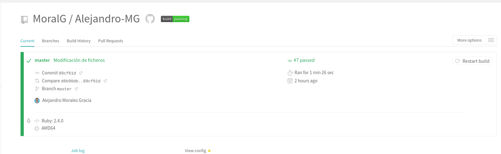

# Introducción a la integración continua

#### Vamos a realizar una integración continua con Travis con la ayuda de django.

## Tarea 1: Despliegue de una página web estática (build, deploy)

Generar una página web estática con un generador de paginas estáticas y desplegarla.

* En el repositorio GitHub sólo tienen que estar los ficheros markdown.
* La página se debe generar en el sistema de integración continúa, por lo tanto debemos instalar las herramientas necesarias.
* Investiga si podemos desplegar de forma automática en el servicio elegido (si es necesario cambia el servicio de hosting para el despliegue).

Tenemos en el directorio `Alejandro-MG` de nuestro equipo, la configuración de nuestra página generada con Jekyll (Si quieres saber como instalar y configurar Jekyll pulse [AQUÍ](https://github.com/MoralG/Instalacion_y_Configuracion_de_Jekyll/blob/master/Instalacion_Jekyll.md#intalaci%C3%B3n-de-jekyll)), esta la vamos a subir a un repositorio de Github para que Travis la detecte y pueda realizar la integración continua.

Pero antes vamos a crea el fichero `.gitignore` en el directorio para indicar que fichero o directorios no queremos subir. Tenemos que indicarle que no suba a GitHub el directorio donde se generan los `html`, en nuestro caso `_site`.

~~~
cat .gitignore 
    _site/
    .sass-cache/
    .jekyll-metadata
    alembic-jekyll-theme-*.gem
    Gemfile.lock
    **/Gemfile.lock
~~~

> NOTA: Los demás fichero y directorios a parte del `_site` los he metido porque no son necesario para la generación de la página estática.

Ahora vamos a subir el directorio al repositorio creado y en la rama master. El branch master va ser el que contenga todos los fichero de configuración, static, etc..

###### Subiendo nuestro directorio `Alejandro-MG` a GitHub
~~~
cd Alejandro-MG
git init
git add .
git commit -m 'Creación del repo'
git remote add origin git@github.com:MoralG/Alejandro-MG.git
git push -u origin master
~~~

Cuando tengamos subido el directorio, vamos a crear un nuevo branch llamado `gh-pages` donde subiremos el directorio `_site`,  que es el que contiene los ficheros `html`.

###### Creamos la rama `gh-pages`
------------------------------------


------------------------------------

Además tenemos que activar GitHub Pages y si tenemos un Dominio propio se lo indicamos también (Si quieres saer como activar GitHub Pages con dominio propio pulse [AQUÍ](https://github.com/MoralG/Trabajando_con_GitHub-Pages/blob/master/Trabajando_con_Github_Pages.md#trabajando-con-github-pages))

Iniciamos en Travis con nuestro Github e indicamos la opción **Only select repositories** y seleccionamos nuestro repositorio **Alejandro-MG**.

###### Añadimos el repositorio Alejandro-MG
------------------------------------


------------------------------------

Como podemos ver, ya nos sale agregado a Travis:

------------------------------------


------------------------------------

Ahora tenemos que creamos el fichero `.travis.yml` en el repositorio, este fichero es la configuración que va a seguir Travis para realizar la integración continua.

###### Añadimos estos pasos al fichero `.travis.yml`
```yml
language: ruby
rvm:
  - 2.4.0

before_install:
#  - gem update --system
  - gem install bundler
  -
script:
  - bundle install
  - bundle exec jekyll build

notifications:
  email: false

branches:
  only:
    - master

env:
  global:
    - NOKOGIRI_USE_SYSTEM_LIBRARIES=true
sudo: false

deploy:
  provider: pages
  skip_cleanup: true
  local_dir: _site
  github_token: $GITHUB_TOKEN
  on:
    repo: MoralG/Alejandro-MG
    on:
      branch: gh-pages
  fqdn: www.alejandro-mg.com
```

También tenemos que crear el fichero `CNAME` y añadir nuestro dominio, si tenemos uno comprado.

###### Añadimos el fichero `CNAME`
~~~
www.alejandro-mg.com
~~~

Ahora vamos a generar el Tokens necesario para que Travis pueda realizar la integración continua. Para generar esto tenemos que ir a **Settings > Developer settings > Personal access tokens** y hacer clic en **Generate new token**. 

###### Creamos el Tokens
------------------------------------


------------------------------------

Nos saldrá una serie de opciones. Las cuales tenemos que seleccionar **repo** y **admin:repo_hook** para concederle permisos de escritura y lesctura a Travis.

###### Le concedemos los permisos a Travis
------------------------------------


------------------------------------

Cuando le demos a **Generate token** nos saldrá el código del Tokens, el cual tendremos que copiar. 
###### Copiamos el token
------------------------------------


------------------------------------

Con el token copiado nos dirigimos a Travis, al **settings** del repositorio, y nos vamos al apartado de **Enviroment Variables** y añadimos un token nuevo.

En el apartado **Nombre** le indicamos `GITHUB_TOKEN` y en el apartado **Value** pegamos el token, lo demás lo dejamos por defecto y le damos a **add**.

###### Añadimos a Travis el Token
------------------------------------


------------------------------------

Ahora ya tendremos todo listo para que se realice la integración continua, para comprobar funciona tenemos que realizar cambios en nuestra configuración de nuestra página estática y realizar un `git push -u origin master`. Travis empezará a trabajar y a realizar las pautas que le hemos indicado en el fichero `.travis.yml`.

###### Mostrando el Job log de Travis
~~~
Worker information

Build system information

$ git clone --depth=50 --branch=master https://github.com/MoralG/Alejandro-MG.git MoralG/Alejandro-MG
MoralG/Alejandro-MG
Cloning into 'MoralG/Alejandro-MG'...
$ cd MoralG/Alejandro-MG
$ git checkout -qf 4c58780e533a84ca1ad807ae5fea731ac286fc3f


Setting environment variables from repository settings
$ export GITHUB_TOKEN=[secure]

Setting environment variables from .travis.yml
$ export NOKOGIRI_USE_SYSTEM_LIBRARIES=true

rvm use 2.4.0 --install --binary --fuzzy

$ export BUNDLE_GEMFILE=$PWD/Gemfile
$ ruby --version

gem install bundler
bundle install --jobs=3 --retry=3

bundle install
Using concurrent-ruby 1.1.5
Using i18n 0.9.5
Using minitest 5.14.0
Using thread_safe 0.3.6
Using tzinfo 1.2.6
Using activesupport 5.2.4.1
Using public_suffix 4.0.3
Using addressable 2.7.0
Using colorator 1.1.0
Using eventmachine 1.2.7
Using http_parser.rb 0.6.0
Using em-websocket 0.5.1
Using rb-fsevent 0.10.3
Using ffi 1.12.2
Using rb-inotify 0.10.1
Using sass-listen 4.0.0
Using sass 3.7.4
Using jekyll-sass-converter 1.5.2
Using listen 3.2.1
Using jekyll-watch 2.2.1
Using kramdown 1.17.0
Using liquid 4.0.3
Using mercenary 0.3.6
Using forwardable-extended 2.6.0
Using pathutil 0.16.2
Using rouge 3.15.0
Using safe_yaml 1.0.5
Using jekyll 3.8.6
Using ruby-enum 0.7.2
Using commonmarker 0.21.0
Using jekyll-commonmark 1.3.1
Using jekyll-default-layout 0.1.4
Using jekyll-feed 0.13.0
Using jekyll-include-cache 0.2.0
Using mini_portile2 2.4.0
Using nokogiri 1.10.7
Using html-pipeline 2.12.3
Using jekyll-mentions 1.5.1
Using jekyll-paginate 1.1.0
Using jekyll-redirect-from 0.16.0
Using jekyll-seo-tag 2.6.1
Using jekyll-sitemap 0.13.0
Using gemoji 3.0.1
Using jemoji 0.11.1
Using alembic-jekyll-theme 3.1.0 from source at `.`
Using bundler 2.1.4
Bundle complete! 1 Gemfile dependency, 46 gems now installed.
Use `bundle info [gemname]` to see where a bundled gem is installed.
The command "bundle install" exited with 0.
$ bundle exec jekyll build
Configuration file: /home/travis/build/MoralG/Alejandro-MG/_config.yml
            Source: /home/travis/build/MoralG/Alejandro-MG
       Destination: /home/travis/build/MoralG/Alejandro-MG/_site
 Incremental build: disabled. Enable with --incremental
      Generating... 
       Jekyll Feed: Generating feed for posts
                    done in 3.135 seconds.
 Auto-regeneration: disabled. Use --watch to enable.
The command "bundle exec jekyll build" exited with 0.

$ rvm $(travis_internal_ruby) --fuzzy do ruby -S gem install dpl

Installing deploy dependencies
Logged in as @MoralG (Alejandro Morales Gracia)
cd /tmp/d20200203-7718-1g0d5gj/work
Preparing deploy
Deploying application
Done. Your build exited with 0.
~~~

Terminada la integración correctamente, Travis nos mostrará el mensaje `Done. Your build exited with 0` y se mostrará así:

------------------------------------


------------------------------------

## Tarea 2: Integración continúa de aplicación django (Test + Deploy)

Vamos a trabajar con el repositorio de la aplicación django_tutorial. Esta aplicación tiene definidas una serie de test, que podemos estudiar en el fichero `tests.py` del directorio `polls`.

Para ejecutar las pruebas unitarias, ejecutamos la instrucción `python3 manage.py test`.

* Estudia las distintas pruebas que se han realizado, y modifica el código de la aplicación para que al menos una de ella no se ejecute de manera exitosa.

A continuación vamos a configurar la integración continúa para que cada vez que hagamos un commit se haga la ejecución de test en travis.

* Crea un fichero .travis.yml para realizar de los tests en travis. Entrega el fichero .travis.yml, una captura de pantalla con un resltado exitoso de la IC y otro con un error.

Siguiendo la guía de esta página: [Continuous delivery of a Django app from Travis CI to PythonAnywhere](https://flowfx.de/blog/continuous-delivery-of-a-django-app-from-travis-ci-to-pythonanywhere/). Para además de realizar los tests, se haga un despliegue al servicio **pythonanyhere**.

* Entrega un breve descripción de los pasos más importantes para realizar el despliegue desde travis.